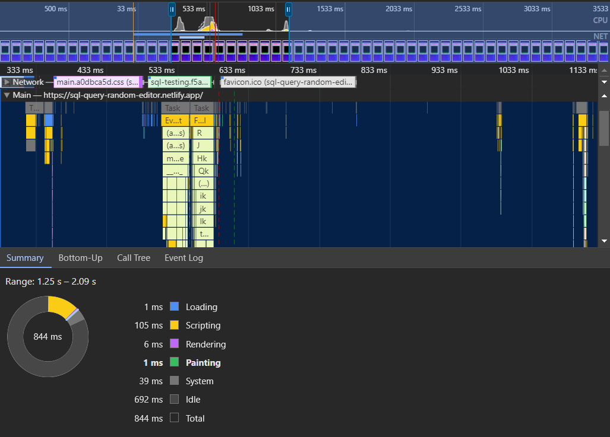

# SQL Editor Web Application

## Overview

This repository hosts a web-based SQL Editor application built using React. The application enables users to execute predefined SQL queries, visualize the results in a tabulated format, and interact with a built-in SQL query editor.

Also, there are queries that load large amount of data without crashing the application 
1. SELECT * FROM order_details; displays 2156 data without crashing the browser.
2. SELECT * FROM orders; displays 831 data without crashing the browser.
   
## Live Demo

You can access the live version of this application at: [SQL Query Random Editor](https://sql-query-random-editor.netlify.app/)

## Technology Stack

- **JavaScript Framework**: React.js
- **Major Plugins/Packages Installed**:
  - Ace Editor: For providing an efficient SQL query editor interface.
  - React Bootstrap: For styling and responsive design components.
  - (Any other relevant packages or plugins you've used.)

## Features

1. **Predefined Queries**: Users can select from a list of predefined SQL queries.
2. **Query Execution**: Upon selecting a query, the application fetches and displays the corresponding data.
3. **Random Query Execution**: An option to execute a random query from the predefined list.
4. **Query Editor**: An interface to input custom SQL queries and execute them.

## Performance Metrics

- **Page Load Time**: To measure the page load time of the application, you can utilize the built-in developer tools available in modern web browsers such as Google Chrome.
  

  
- **Measurement Method**: Follow the steps below to measure the page load time using Google Chrome's Developer Tools:
  1. **Open Developer Tools**: Right-click on your web page and select `Inspect` or press `Ctrl + Shift + I` (Windows/Linux) or `Cmd + Option + I` (Mac) to open Developer Tools.
  2. **Navigate to the Performance Tab**: Click on the `Performance` tab within Developer Tools to access the performance analysis features.
  3. **Start Recording**: Click on the record button (a solid circle icon) or press `Ctrl + E` (Windows/Linux) or `Cmd + E` (Mac) to start recording the page load performance.
  4. **Reload the Page**: After initiating the recording, reload your application page to capture the performance data.
  5. **Analyze Results**: Stop the recording by clicking the stop button (a solid square icon) or pressing `Ctrl + E` (Windows/Linux) or `Cmd + E` (Mac) once the page has loaded completely. Analyze the timeline chart to identify the total page load time and other performance metrics.

## Optimizations for Performance

To enhance the user experience and optimize the application's performance, the following measures were implemented:

1. **Lazy Loading**: Implemented lazy loading for components to ensure that only essential components are loaded initially, reducing the initial load time.
2. **Code Splitting**: Utilized React's code splitting feature to split the application into smaller chunks, enabling faster loading times for users.
3. **Image Optimization**: Compressed and optimized images to reduce the overall page size and improve load times.
4. **Caching Strategies**: Implemented caching strategies using service workers to store static assets and enable offline access for returning users.
5. **Minification & Bundling**: Utilized bundlers like Webpack to minify and bundle JavaScript and CSS files, reducing the overall file size and improving load times.

## Setup & Usage

1. Clone the repository to your local machine.
2. Navigate to the project directory.
3. Install the necessary dependencies using `npm install`.
4. Start the development server with `npm start`.
5. Access the application in your browser at `http://localhost:3000`.

## Dependencies

- React.js
- Ace Editor
- React Bootstrap
- (List any other dependencies here.)
